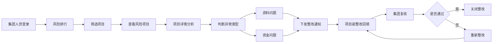

## 1. 产品概述

农民工工资专户数据看板是面向集团工程管理部和法务风控人员的数据驱动型监控平台，用于跟踪各项目工资专户管理状况，提前发现欠薪隐患，减少投诉和劳动监察风险。

- 核心目标：通过数据化监控手段，提前发现工资专户管理漏洞，降低企业劳动用工风险
- 目标用户：集团工程管理部人员、法务风控人员、项目部管理人员

## 2. 核心功能

### 2.1 用户角色
| 角色 | 登录方式 | 核心权限 |
|------|----------|----------|
| 集团管理员 | 账号登录 | 查看全部项目、下发整改、复核关闭、筛选统计 |
| 项目部人员 | 账号登录 | 查看本项目、回填整改说明、确认工资发放 |

### 2.2 功能模块
1. **风险排行模块**：多维度筛选、风险等级展示、异常指标高亮、项目快速定位
2. **项目详情模块**：劳务队伍管理、在场人数统计、工资发放曲线、异常人员名单
3. **整改跟进模块**：整改下发、责任分配、进度跟踪、复核关闭、整改记录追溯

### 2.3 页面详情
| 页面名称 | 模块名称 | 功能描述 |
|----------|----------|----------|
| 风险排行页 | 筛选区域 | 支持按地区、项目类型、总包单位多维度筛选 |
| 风险排行页 | 风险概览卡片 | 展示项目总数、高风险数、中风险数、低风险数 |
| 风险排行页 | 风险排行榜 | 按风险等级排序，显示关键异常指标，支持点击进入详情 |
| 项目详情页 | 项目基础信息 | 项目名称、地区、总包单位、劳务队伍、在场人数 |
| 项目详情页 | 工资发放曲线 | 最近三期工资发放趋势图，发放金额、人数对比 |
| 项目详情页 | 异常名单列表 | 银行退回、工资未确认、连续未发薪等异常人员 |
| 项目详情页 | 专户余额监控 | 专户余额、月均工资、可发薪月数预警 |
| 整改跟进页 | 整改列表 | 待整改、整改中、已复核状态分类展示 |
| 整改跟进页 | 整改下发弹窗 | 填写整改要求、责任人、完成日期 |
| 整改跟进页 | 整改详情抽屉 | 查看整改历史、处理说明、复核操作 |

## 3. 核心流程

### 3.1 风险监控流程
集团人员登录系统 → 进入风险排行模块 → 按条件筛选项目 → 查看风险排行列表 → 点击高风险项目查看详情 → 分析异常原因（资料问题/资金问题）→ 下发整改要求

### 3.2 整改跟进流程
集团下发整改通知 → 项目部接收整改任务 → 项目部回填处理说明 → 集团复核整改结果 → 符合要求则关闭，不符合则重新整改

## 4. 用户界面设计

### 4.1 设计风格
- 主色调：深蓝（#1e3a5f）作为主色，体现专业、稳重的企业级产品调性
- 辅助色：红色（#e74c3c）表示高风险预警，橙色（#f39c12）表示中风险，绿色（#27ae60）表示低风险
- 整体风格：数据驱动的专业B端风格，卡片式布局，清晰的数据层级
- 字体：使用"PingFang SC"、"Microsoft YaHei"等中文友好字体，数字使用等宽字体增强可读性
- 图标：线性风格图标，与数据展示协调统一

### 4.2 页面设计概览
| 页面名称 | 模块名称 | UI元素 |
|----------|----------|--------|
| 风险排行页 | 顶部导航 | 左侧系统Logo，右侧用户信息、消息通知 |
| 风险排行页 | 统计概览 | 四个数据卡片，分别展示项目总数、高/中/低风险数量 |
| 风险排行页 | 筛选栏 | 地区、项目类型、总包单位三个下拉筛选器 + 搜索框 |
| 风险排行页 | 风险排行榜 | 表格形式，包含排名、项目名称、风险等级、异常指标、操作按钮 |
| 项目详情页 | 项目概览 | 项目基础信息卡片 + 风险等级标签 |
| 项目详情页 | 数据图表 | 工资发放曲线图（折线/柱状混合）、专户余额仪表盘 |
| 项目详情页 | 劳务队伍 | 队伍列表卡片，显示队伍名称、人数、负责人 |
| 项目详情页 | 异常名单 | 标签页切换：银行退回/未确认/连续未发薪，人员列表表格 |
| 整改跟进页 | 状态标签 | 待整改/整改中/已复核 三个状态Tab |
| 整改跟进页 | 整改卡片 | 每个整改项为卡片，显示项目名、整改要求、责任人、截止日期、状态 |
| 整改跟进页 | 操作按钮 | 下发整改、查看详情、复核通过、驳回重改 |

### 4.3 响应式
- 桌面端优先设计，最小支持1280px宽度
- 平板端自适应布局，表格支持横向滚动
- 数据图表采用响应式设计，自动适配容器宽度

### 4.4 动效设计
- 页面加载：数据卡片依次淡入，营造层次感
- 风险等级标签：呼吸灯效果，高风险红色脉冲提示
- 悬停交互：卡片悬浮轻微上移并添加阴影
- 数据更新：数字滚动动画，图表渐进式绘制
