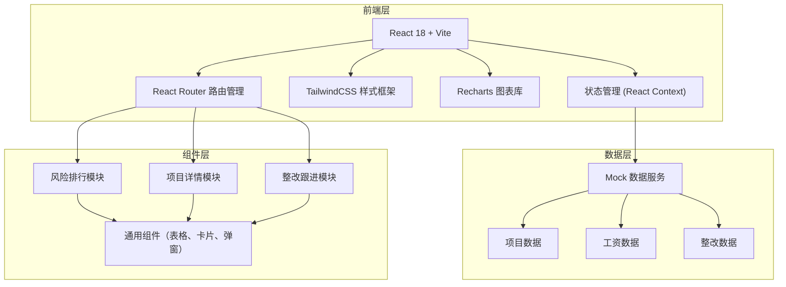

## 1. 架构设计



## 2. 技术说明
- 前端框架：React 18 + TypeScript + Vite
- 样式方案：TailwindCSS 3.x
- 图表库：Recharts 2.x（React生态图表库，支持折线图、柱状图、饼图等）
- 路由管理：React Router Dom 6.x
- 状态管理：React Context + useReducer
- 图标库：Lucide React
- 数据方案：前端 Mock 数据，模拟真实业务场景

## 3. 路由定义
| 路由路径 | 页面名称 | 说明 |
|----------|----------|------|
| / | 风险排行页 | 默认首页，展示项目风险排行 |
| /project/:id | 项目详情页 | 展示单个项目的详细信息 |
| /rectification | 整改跟进页 | 展示整改任务列表和跟进 |

## 4. 数据模型

### 4.1 项目数据模型
```typescript
interface Project {
  id: string;
  name: string;
  region: string;
  projectType: string;
  generalContractor: string;
  riskLevel: 'high' | 'medium' | 'low';
  accountBalance: number;
  monthlyAverageSalary: number;
  payrollMonthsAvailable: number;
  totalWorkers: number;
  laborTeams: LaborTeam[];
  abnormalIndicators: string[];
  lastPayrollDate: string;
  consecutiveUnpaidMonths: number;
  confirmationRate: number;
  bankReturnCount: number;
}

interface LaborTeam {
  id: string;
  name: string;
  leader: string;
  phone: string;
  workerCount: number;
  workType: string;
}
```

### 4.2 工资发放数据模型
```typescript
interface PayrollRecord {
  id: string;
  projectId: string;
  month: string;
  totalAmount: number;
  totalWorkers: number;
  actualPayCount: number;
  bankReturnCount: number;
  unconfirmedCount: number;
  perCapitaSalary: number;
}
```

### 4.3 异常人员数据模型
```typescript
interface AbnormalWorker {
  id: string;
  name: string;
  idCard: string;
  laborTeam: string;
  abnormalType: 'bank_return' | 'unconfirmed' | 'consecutive_unpaid';
  abnormalCount: number;
  amount: number;
  lastUpdate: string;
}
```

### 4.4 整改数据模型
```typescript
interface Rectification {
  id: string;
  projectId: string;
  projectName: string;
  title: string;
  content: string;
  level: 'high' | 'medium' | 'low';
  status: 'pending' | 'in_progress' | 'reviewed' | 'closed';
  assignee: string;
  assignDepartment: string;
  deadline: string;
  createdAt: string;
  updatedAt: string;
  handler: string;
  handleDescription: string;
  handleDate: string;
  reviewer: string;
  reviewComment: string;
  reviewDate: string;
}
```

## 5. 核心目录结构
```
src/
├── assets/          # 静态资源
├── components/      # 通用组件
│   ├── layout/      # 布局组件
│   ├── ui/          # 基础UI组件（卡片、按钮、弹窗等）
│   └── charts/      # 图表组件
├── pages/           # 页面组件
│   ├── RiskRanking/ # 风险排行页
│   ├── ProjectDetail/ # 项目详情页
│   └── Rectification/ # 整改跟进页
├── data/            # Mock数据
├── types/           # TypeScript类型定义
├── context/         # React Context状态管理
├── hooks/           # 自定义Hooks
├── utils/           # 工具函数
├── App.tsx
├── main.tsx
└── index.css
```
